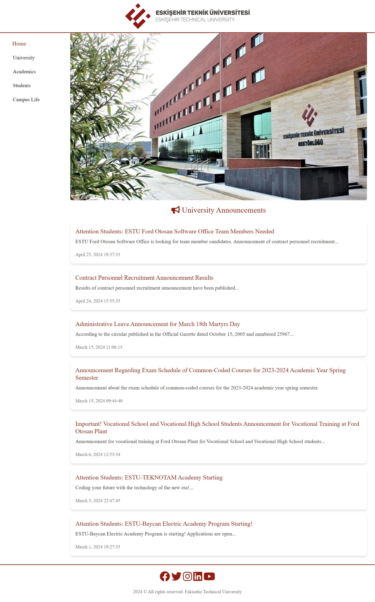
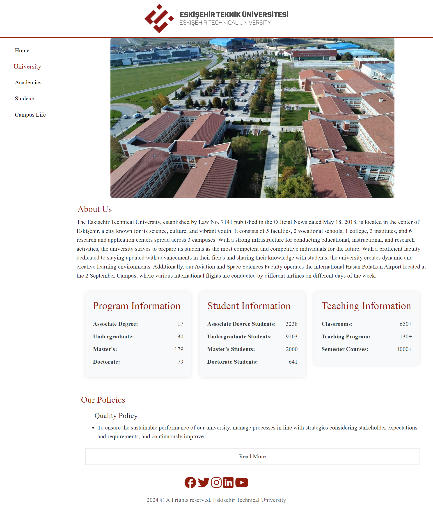
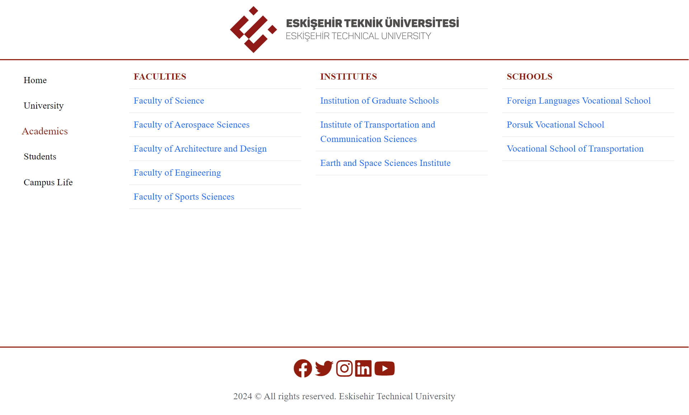
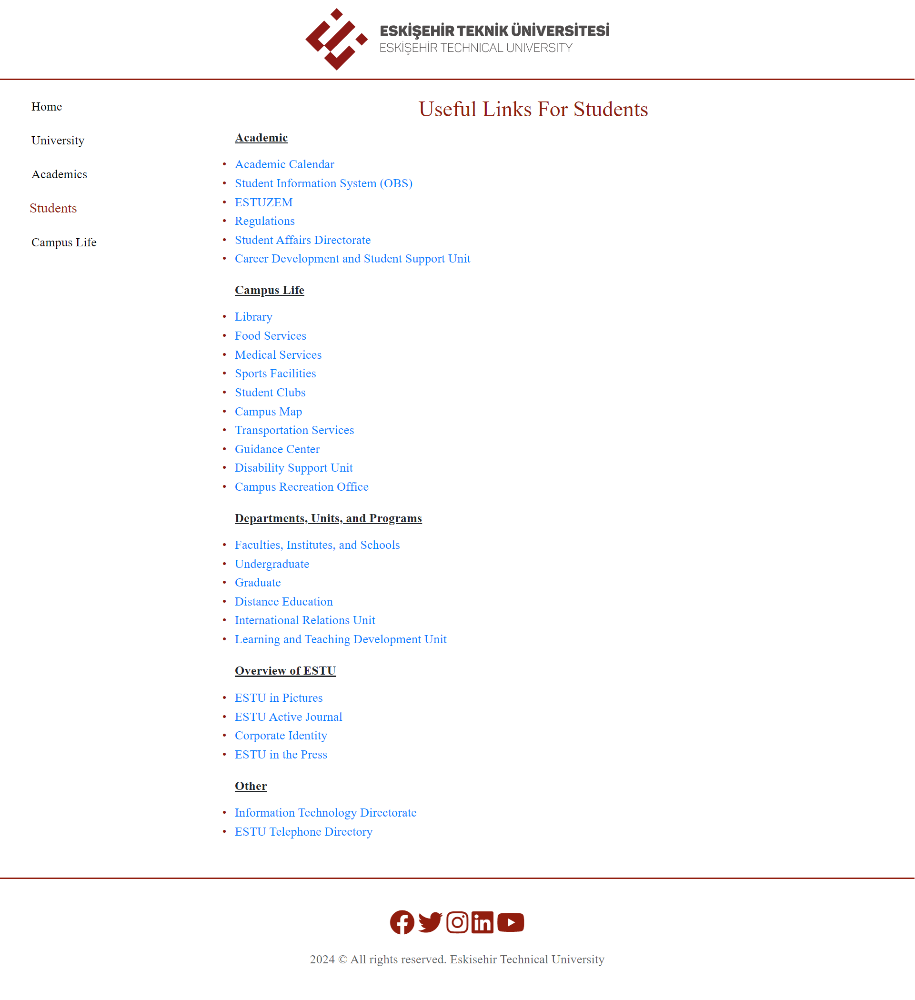
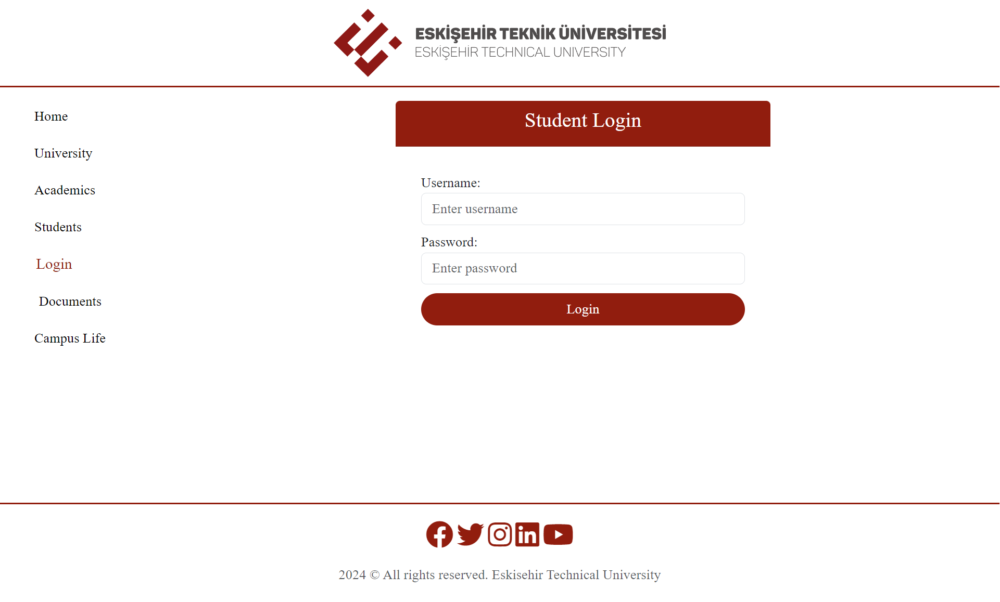
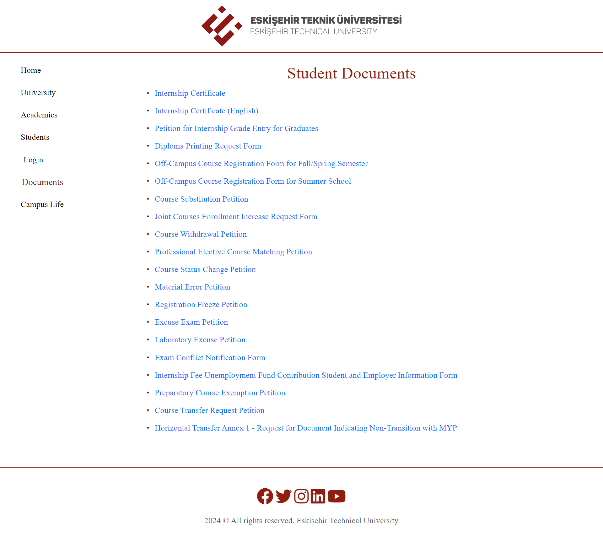

# University Website

This project is a Bootstrap-based, responsive university website developed as an assignment during computer engineering education.

## Purpose

This website aims to present various departments and information of a university using HTML, CSS, and Bootstrap.

## Pages

1. **Home (home.html)**
   

2. **University (university.html)**
   

3. **Academics (academics.html)**
   

4 **Campus Life (campuslife.html)**
   

5. **Students (students.html)**
   

6. **Student Login (login.html)**
   

7. **Documents (documents.html)**
   

## Desired Features

- **Responsive Design:** Each page is compatible with different screen sizes.
- **Navigation Bar:** The left-hand side navigation bar provides easy access to each page. The font size of the active page is distinct from others.
- **Form Elements:** Forms are made user-friendly with appropriate input types and labels.
- **Footer:** Each page has a footer containing copyright and authorship information.
- **Markup Validation:** Each page is validated using the Markup Validation Service.

## Desired Page Features

### Home

- Displays university image and announcements.
- Image enlarges on mouse hover.

### University

- Provides detailed information about the university.
- "Show Less / More" button toggles text visibility.

### Academics

- Presents information about faculties, institutes, and vocational schools in tables.

### Campus Life

- Displays university video. Video player opens on click.

### Students

- This page provides useful links for students, including academic resources, campus life amenities, and information about departments, units, and programs at ESTU.
  
### Student Login

- This section allows user login with username and password, keeping passwords confidential.
- Upon login button press, users are redirected to the "Home" page.
  
### Documents

- Provides access to documents for students.
